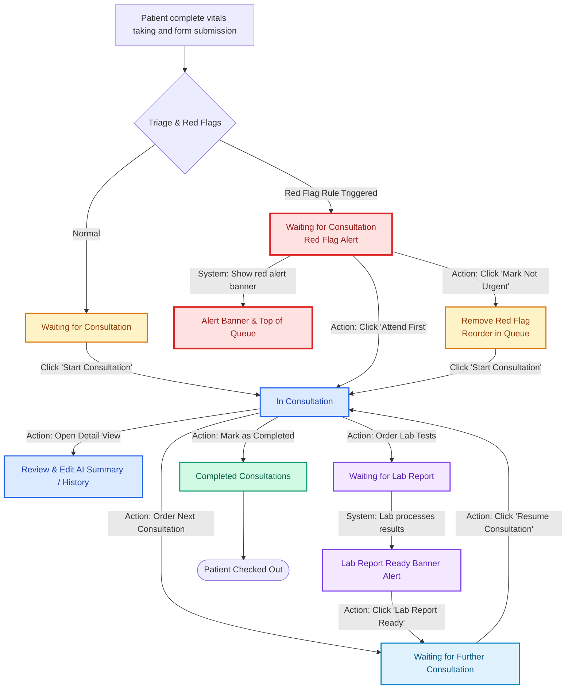

# 🏥 EMR Doctor Interface - UI Architecture Document

## Executive Summary

This document outlines the complete UI architecture for the Emergency Department Doctor's Interface, a pre-consultation history-taking system designed for the Green Zone. The system provides real-time access to patient submissions, intelligent red-flag prioritization, and queue management capabilities optimized for clinical workflows.

---

## 1. System Architecture Overview

### 1.1 High-Level Architecture

```
┌─────────────────────────────────────────────────────────────┐
│                     Doctor's Interface UI                    │
│                      (React + TypeScript)                    │
└─────────────────────────────────────────────────────────────┘
                              │
                              │ HTTP/REST
                              ▼
┌─────────────────────────────────────────────────────────────┐
│                       API Gateway                            │
│        (Configured via VITE_API_BASE_URL env var)           │
└─────────────────────────────────────────────────────────────┘
                              │
                              ▼
┌─────────────────────────────────────────────────────────────┐
│                    Backend Database                          │
│              (Patient EMR Submissions)                       │
└─────────────────────────────────────────────────────────────┘
```

### 1.2 Technology Stack

- **Framework**: React 18 with TypeScript
- **Build Tool**: Vite (fast dev server, optimized builds)
- **Styling**: TailwindCSS (utility-first, responsive)
- **Icons**: Lucide React (medical-appropriate iconography)
- **State Management**: React Context API + Hooks
- **HTTP Client**: Native Fetch API with error boundaries

---

## 2. Component Hierarchy

```
App
├── AppProvider (Context)
│   └── State: submissions, loading, error, lastRefresh
│
└── DoctorDashboard
    ├── Header
    │   ├── Title & Branding
    │   ├── Refresh Controls
    │   └── Status Indicators
    │
    ├── AlertBanner (conditional)
    │   ├── Error Display
    │   └── Network Status
    │
    ├── QueueStats
    │   ├── Total Patients
    │   ├── Waiting Count
    │   ├── In Progress Count
    │   └── Red Flag Count
    │
    ├── LoadingState
    ├── EmptyState
    ├── PatientTable
    │   └── PatientRow (repeated)
    │       ├── QueuePosition
    │       ├── Registration Number
    │       ├── Age/Gender
    │       ├── Arrival Time
    │       ├── StatusBadge
    │       └── ActionButtons
    │           ├── ViewDetails
    │           ├── AttendFirst (red-flag only)
    │           └── MarkNotUrgent (red-flag only)
    └── PatientDetailView (conditional)
      ├── Demographics
      ├── Arrival/Triage
      ├── Complaints
      ├── AI Summary (editable)
      └── Optional Notes/Additional Details
```

---

## 3. Data Flow & State Management

### 3.1 Data Flow Diagram

```
┌─────────────┐
│  API Call   │ ──────┐
└─────────────┘       │
                      ▼
┌─────────────────────────────────────┐
│      Raw API Response               │
│  Array of stringified JSON objects  │
└─────────────────────────────────────┘
                      │
                      │ Parse & Validate
                      ▼
┌─────────────────────────────────────┐
│    Parsed Submissions               │
│  - JSON.parse(complaints)           │
│  - JSON.parse(details)              │
│  - Validate required fields         │
└─────────────────────────────────────┘
                      │
                      │ Transform & Enrich
                      ▼
┌─────────────────────────────────────┐
│    Enriched Patient Objects         │
│  - Add queue position               │
│  - Calculate wait time              │
│  - Derive patient info from details │
└─────────────────────────────────────┘
                      │
                      │ Sort & Prioritize
                      ▼
┌─────────────────────────────────────┐
│    Prioritized Queue                │
│  1. Red-flag patients (top)         │
│  2. Regular patients (by arrival)   │
└─────────────────────────────────────┘
                      │
                      │ Render
                      ▼
┌─────────────────────────────────────┐
│    UI Components                    │
│  - PatientRow components            │
│  - PatientDetailView                │
│  - Status indicators                │
└─────────────────────────────────────┘
```

### 3.2 State Management Strategy

**Context-Based Architecture**
```typescript
interface AppState {
  submissions: PatientSubmission[];
  loading: boolean;
  error: string | null;
  lastRefresh: Date | null;
  autoRefreshEnabled: boolean;
  newRedFlags: PatientSubmission[];
  labNotifications: PatientSubmission[];
}

interface AppActions {
  fetchSubmissions: () => Promise<void>;
  attendFirst: (id: number | string) => void;
  markNotUrgent: (id: number | string) => void;
  updateStatus: (id: number | string, status: PatientStatus) => void;
  toggleAutoRefresh: () => void;
  manualRefresh: () => void;
  dismissRedFlag: (id: number | string) => void;
  dismissAllRedFlags: () => void;
  orderLabs: (id: number | string, labs: string[]) => void;
  addLabNotification: (patient: PatientSubmission) => void;
  dismissLabNotification: (id: number | string) => void;
  dismissAllLabNotifications: () => void;
}
```

**State Update Flow**:
1. User action triggers action function
2. Optimistic UI update (immediate feedback in queue sorting and tabs)
3. API call updates DB consultation status, ordered labs, clinical history, or overrides red-flags
4. Reconciliation on next auto-refresh (every 30 seconds)
5. Rollback to database-validated state on failure

### 3.3 Patient Management Flow Diagram

The following Mermaid diagram visualizes the complete patient lifecycle, transitions, tabs, and clinical actions within the dashboard:



---

## 4. Data Models & Type System

### 4.1 API Response Structure

```typescript
interface APISubmission {
  id: number;
  complaints: string;        // Stringified JSON array
  details: string;           // Stringified JSON object
  ai_summary: string;
  triage_zone: TriageZone;
  red_flag: 'YES' | 'NO';
  final_notes_ai?: string;
  created_at: string;        // ISO format: "2026-01-13 04:22:41"
}
```

### 4.2 Parsed Patient Submission

```typescript
interface PatientSubmission {
  id: number;
  queueNumber: string;       // Generated: "Q001"
  registrationNumber: string; // Derived from parsed details
  patientName: string;
  age: number;
  gender: 'Male' | 'Female' | 'Other';
  complaints: string[];      // Parsed from JSON string
  details: PatientDetails;   // Parsed from JSON string
  aiSummary: string;
  patientNotes?: string;
  triageZone: TriageZone;
  isRedFlag: boolean;
  isPriority: boolean;       // Local state for "Attend First"
  status: PatientStatus;
  arrivalTime: Date;
  createdAt: string;
}

interface PatientDetails {
  name?: string;
  age?: number;
  gender?: string;
  registrationNumber?: string;
  // ... additional fields from EMR form
}

type TriageZone = 'RED' | 'YELLOW' | 'GREEN';
type PatientStatus = 'Waiting' | 'In Progress' | 'Completed';
```

### 4.3 Parsing Logic with Error Handling

```typescript
function parseSubmission(raw: APISubmission): PatientSubmission | null {
  try {
    // Safe parsing with fallbacks
    const complaints = safeJSONParse<string[]>(raw.complaints, []);
    const details = safeJSONParse<PatientDetails>(raw.details, {});
    
    return {
      id: raw.id,
      queueNumber: generateQueueNumber(raw.id),
      registrationNumber: details.registrationNumber || details.rn || `RN${String(raw.id).padStart(7, '0')}`,
      patientName: extractPatientName(details),
      age: extractAge(details),
      gender: extractGender(details),
      complaints,
      details,
      aiSummary: raw.ai_summary || 'No AI summary available',
      patientNotes: raw.final_notes_ai,
      triageZone: raw.triage_zone,
      isRedFlag: raw.red_flag?.toUpperCase() === 'YES',
      isPriority: raw.red_flag?.toUpperCase() === 'YES', // Initial priority state
      status: 'Waiting', // Default status
      arrivalTime: parseDate(raw.created_at),
      createdAt: raw.created_at
    };
  } catch (error) {
    console.error(`Failed to parse submission ${raw.id}:`, error);
    return null;
  }
}

function safeJSONParse<T>(jsonString: string, fallback: T): T {
  try {
    return JSON.parse(jsonString) as T;
  } catch {
    return fallback;
  }
}
```

---

## 5. Queue Management & Prioritization Logic

### 5.1 Queue Ordering Algorithm

```typescript
function sortPatientQueue(submissions: PatientSubmission[]): PatientSubmission[] {
  return [...submissions].sort((a, b) => {
    // Priority 1: Red-flag AND manually prioritized
    if (a.isPriority && !b.isPriority) return -1;
    if (!a.isPriority && b.isPriority) return 1;
    
    // Priority 2: Red-flag (even if not manually prioritized)
    if (a.isRedFlag && !b.isRedFlag) return -1;
    if (!a.isRedFlag && b.isRedFlag) return 1;
    
    // Priority 3: Status (In Progress > Waiting > Completed)
    const statusOrder = { 'In Progress': 0, 'Waiting': 1, 'Completed': 2 };
    const statusDiff = statusOrder[a.status] - statusOrder[b.status];
    if (statusDiff !== 0) return statusDiff;
    
    // Priority 4: Arrival time (earlier = higher priority)
    return a.arrivalTime.getTime() - b.arrivalTime.getTime();
  });
}
```

### 5.2 Red-Flag Action Handlers

```typescript
// Move patient to front of queue
function handleAttendFirst(patientId: number) {
  setSubmissions(prev => 
    prev.map(sub => 
      sub.id === patientId 
        ? { ...sub, isPriority: true, status: 'In Progress' }
        : sub
    )
  );
  
  // Future: POST /api/submissions/{id}/priority
}

// Remove priority and return to normal queue
function handleMarkNotUrgent(patientId: number) {
  setSubmissions(prev =>
    prev.map(sub =>
      sub.id === patientId
        ? { ...sub, isPriority: false, isRedFlag: false }
        : sub
    )
  );
  
  // Future: POST /api/submissions/{id}/deprioritize
}
```

---

## 6. API Integration Layer

### 6.1 API Service Module

```typescript
// src/services/api.ts

const API_BASE_URL = import.meta.env.VITE_API_BASE_URL || 'http://localhost:5000/api';
const HOSPITAL_API_KEY = import.meta.env.VITE_HOSPITAL_API_KEY || '';

const PUBLIC_HEADERS = {
  'Content-Type': 'application/json',
  'ngrok-skip-browser-warning': 'true'
};

const PROTECTED_HEADERS = {
  'Content-Type': 'application/json',
  'x-api-key': HOSPITAL_API_KEY,
  'ngrok-skip-browser-warning': 'true'
};

class APIService {
  async login(email: string, password: string): Promise<Doctor> {
    const response = await fetch(`${API_BASE_URL}/auth/login`, {
      method: 'POST',
      headers: PUBLIC_HEADERS,
      body: JSON.stringify({ email, password }),
    });
    const data = await response.json();
    if (!response.ok) throw new Error(data.error || 'Login failed');
    return data.doctor as Doctor;
  }

  async fetchSubmissions(): Promise<APISubmission[]> {
    try {
      const response = await fetch(`${API_BASE_URL}/view`, {
        method: 'GET',
        headers: PUBLIC_HEADERS
      });
      if (!response.ok) {
        throw new Error(`HTTP ${response.status}: ${response.statusText}`);
      }
      return await response.json();
    } catch (error) {
      if (error instanceof TypeError) {
        throw new Error('Network error: Unable to reach server');
      }
      throw error;
    }
  }
  
  async startConsultation(patientId: number | string, doctorId: string): Promise<void> {
    const response = await fetch(`${API_BASE_URL}/patient/${patientId}/start-consultation`, {
      method: 'POST',
      headers: PROTECTED_HEADERS,
      body: JSON.stringify({ doctorId }),
    });
    if (!response.ok) {
      const data = await response.json();
      throw new Error(data.error || 'Failed to start consultation');
    }
  }

  async overrideRedFlag(patientId: number | string, doctorId: string): Promise<void> {
    const response = await fetch(`${API_BASE_URL}/patient/${patientId}/override-redflag`, {
      method: 'POST',
      headers: PROTECTED_HEADERS,
      body: JSON.stringify({ doctorId }),
    });
    if (!response.ok) {
      const data = await response.json();
      throw new Error(data.error || 'Failed to override red flag');
    }
  }

  async completeConsultation(patientId: number | string, doctorId: string): Promise<void> {
    const response = await fetch(`${API_BASE_URL}/patient/${patientId}/complete-consultation`, {
      method: 'POST',
      headers: PROTECTED_HEADERS,
      body: JSON.stringify({ doctorId }),
    });
    if (!response.ok) {
      const data = await response.json();
      throw new Error(data.error || 'Failed to complete consultation');
    }
  }

  async updateStatus(patientId: number | string, status: string, doctorId: string): Promise<void> {
    const response = await fetch(`${API_BASE_URL}/patient/${patientId}/update-status`, {
      method: 'POST',
      headers: PROTECTED_HEADERS,
      body: JSON.stringify({ doctorId, status }),
    });
    if (!response.ok) {
      const data = await response.json();
      throw new Error(data.error || 'Failed to update status');
    }
  }

  async orderLabs(patientId: number | string, doctorId: string, orderedLabs: string[]): Promise<void> {
    const response = await fetch(`${API_BASE_URL}/patient/${patientId}/order-labs`, {
      method: 'POST',
      headers: PROTECTED_HEADERS,
      body: JSON.stringify({ doctorId, orderedLabs }),
    });
    if (!response.ok) {
      const data = await response.json();
      throw new Error(data.error || 'Failed to order labs');
    }
  }

  async updateClinicalHistory(patientId: number | string, clinical_history_edited: string): Promise<void> {
    const response = await fetch(`${API_BASE_URL}/patient/${patientId}/update-history`, {
      method: 'POST',
      headers: PROTECTED_HEADERS,
      body: JSON.stringify({ clinical_history_edited }),
    });
    if (!response.ok) {
      const data = await response.json().catch(() => ({}));
      throw new Error(data.error || 'Failed to update clinical history');
    }
  }

  async updateAiSummary(patientId: number | string, ai_summary: string): Promise<void> {
    const response = await fetch(`${API_BASE_URL}/patient/${patientId}/update-summary`, {
      method: 'POST',
      headers: PROTECTED_HEADERS,
      body: JSON.stringify({ ai_summary }),
    });
    if (!response.ok) {
      const data = await response.json().catch(() => ({}));
      throw new Error(data.error || 'Failed to update AI summary');
    }
  }
}

export const apiService = new APIService();
```

### 6.2 Auto-Refresh Mechanism

```typescript
// Auto-refresh is implemented inside AppContext with a useEffect interval.
```

---

## 7. Error Handling & Edge Cases

### 7.1 Error Taxonomy

| Error Type | Cause | UI Response |
|------------|-------|-------------|
| **Network Error** | API unreachable, timeout | Banner alert, retry button, cached data |
| **Parse Error** | Malformed JSON in API response | Skip record, log warning, show partial data |
| **Validation Error** | Missing required fields | Exclude from queue, admin notification |
| **Empty State** | No submissions in system | Friendly empty state with illustration |
| **Auth Error** | (Future) Invalid credentials | Redirect to login |

### 7.2 Error Display Strategy

```typescript
interface ErrorBannerProps {
  error: string;
  severity: 'warning' | 'error' | 'info';
  onDismiss?: () => void;
  onRetry?: () => void;
}

// Non-modal, dismissible banner at top of dashboard
// Auto-dismiss after 10 seconds for warnings
// Persistent for critical errors with retry action
```

### 7.3 Graceful Degradation

- **Stale Data Indicator**: Show "Last updated: X minutes ago" if refresh fails
- **Partial Data Display**: Show successfully parsed records even if some fail
- **Offline Resilience**: Cache last successful fetch, display with warning banner
- **Progressive Enhancement**: Core functionality works, advanced features fail gracefully

---

## 8. Visual Design System

### 8.1 Color Palette (Tailwind Config)

```javascript
colors: {
  clinical: {
    50: '#f5f3ff',   // Background tints
    500: '#8b5cf6',  // Primary actions
    700: '#6d28d9',  // Hover states
  },
  emergency: {
    red: '#ef4444',    // Red-flag indicators
    yellow: '#fbbf24', // Warning states
    green: '#10b981',  // Success/completed
  },
  status: {
    waiting: '#fbbf24',     // Yellow badge
    inProgress: '#3b82f6', // Blue badge
    completed: '#10b981',  // Green badge
  }
}
```

### 8.2 Typography Hierarchy

```css
/* Page Title */
.title { @apply text-3xl font-bold text-gray-900; }

/* Card Title (Patient Name) */
.card-title { @apply text-lg font-semibold text-gray-800; }

/* Labels */
.label { @apply text-sm font-medium text-gray-600; }

/* Body Text */
.body { @apply text-base text-gray-700; }

/* Badge Text */
.badge { @apply text-xs font-semibold uppercase tracking-wide; }
```

### 8.3 Component Styling Guidelines

**PatientCard**
- Clean white background with subtle shadow
- 16px padding, 12px border-radius
- Hover: slight scale (1.01) + shadow increase
- Red-flag: 3px left border + red shadow glow

**Status Badges**
- Rounded pill shape
- Distinct color per status (see color palette)
- 12px height, 6px horizontal padding

**Action Buttons**
- Primary: Purple gradient (clinical.500 → clinical.600)
- Danger: Red (emergency.red)
- Touch target: minimum 44px height
- Clear focus states for keyboard navigation

---

## 9. Interaction Flows

### 9.1 Primary User Journey

```
Doctor arrives at dashboard
    ↓
[Auto-load] Fetch submissions from API
    ↓
Display queue (red-flags at top)
    ↓
Doctor scans queue visually
    ↓
Identifies red-flag case
    ↓
Clicks "Attend First" → Patient moves to #1
    ↓
Clicks "View Details" → Open detailed patient workspace
    ↓
[Auto-refresh] Queue updates every 30s
    ↓
Doctor marks patient as "In Progress" or orders lab tests
    ↓
Consultation begins and tracks status in database
```

### 9.2 Red-Flag Workflow

```
Red-flag patient appears in queue
    ↓
Automatic visual highlight (red border, icon)
    ↓
Automatic queue positioning (top of list)
    ↓
Doctor reviews case
    ↓
[Option A] Click "Attend First"
    → Status: Waiting → In Progress
    → Position: Locked to #1
    ↓
[Option B] Click "Mark Not Urgent"
    → Remove red-flag status
    → Reorder to normal queue position
    → Visual highlight removed
```

### 9.3 Refresh Flow

```
[Automatic Timer: 30s]
    ↓
Background API call
    ↓
[Success]
    → Merge new data
    → Preserve local state (status, priority)
    → Update "Last refreshed" timestamp
    → Smooth transition (no jarring UI shift)
    ↓
[Failure]
    → Show warning banner
    → Keep existing data
    → Increment retry counter
    → Exponential backoff (30s → 60s → 120s)
```

---

## 10. Accessibility & Usability

### 10.1 WCAG 2.1 AA Compliance

- **Color Contrast**: All text meets 4.5:1 ratio
- **Keyboard Navigation**: Full tab order, focus indicators
- **Screen Readers**: Semantic HTML, ARIA labels
- **Touch Targets**: Minimum 44×44px for all buttons
- **Motion**: Respect prefers-reduced-motion

### 10.2 Clinical Usability Considerations

- **Scanability**: Large text, clear hierarchy, whitespace
- **Error Prevention**: Confirmation for destructive actions
- **Flexibility**: Keyboard shortcuts for power users
- **Interruption Tolerance**: No modal dialogs (use banners)
- **Context Preservation**: Remember scroll position on refresh

### 10.3 Responsive Design Breakpoints

```
Mobile:  320px - 768px  (Stacked cards, simplified layout)
Tablet:  768px - 1024px (2-column grid)
Desktop: 1024px+        (Horizontal row layout as shown)
```

---

## 11. Performance Optimization

### 11.1 Optimization Strategies

| Strategy | Implementation | Impact |
|----------|----------------|--------|
| **Memoization** | `React.memo()` on PatientCard | Prevent unnecessary re-renders |
| **Virtual Scrolling** | (Future) For >50 patients | Smooth performance at scale |
| **Debouncing** | Refresh button | Prevent API spam |
| **Code Splitting** | Lazy load detail view | Faster initial load |
| **Image Optimization** | (If avatars added) WebP, lazy loading | Reduced bandwidth |

### 11.2 Bundle Size Targets

- Initial Bundle: < 200KB gzipped
- Time to Interactive: < 2 seconds on 3G
- First Contentful Paint: < 1 second

---

## 12. Security Considerations

### 12.1 Client-Side Security

- **No sensitive data in localStorage**: Use session storage (or secure httpOnly cookies) for active user state.
- **HTTPS Only**: Enforce secure connections in production.
- **XSS Prevention**: React's built-in JSX sanitization handles rendering; all user input fields are sanitized.
- **CORS Configuration**: CORS headers are configured on the API backend to whitelist the frontend domain.
- **Input Validation**: Robust parsing and type checks on raw details before storage or rendering.
- **x-api-key Verification**: Protected database write endpoints verify requests using a hospital API key sent via the `x-api-key` header.

### 12.2 Implemented Authentication Flow

The dashboard requires doctors to authenticate prior to viewing the queue. Clinical audit tracking is established by binding the doctor's credentials to every action.

```
Login Page (Email/Password) ──> POST /api/auth/login ──> Success (JWT/Doctor Object)
                                                                 │
                                                                 ▼
[sessionStorage] ──> Persist Login State ──> Global AuthContext State
                                                     │
                                                     ▼
Write Operations (Override, Start, Complete, Labs) ──> Send staff_id / doctor_id along with request
```

---

## 13. Scalability & Future-Proofing

### 13.1 Scalability Considerations

**Current Design Handles**:
- Up to 100 concurrent patients
- 30-second refresh intervals
- 1-2 simultaneous users per shift

**Future Enhancements for Scale**:
1. **WebSocket Integration**: Replace polling with real-time push events to update status immediately when another clinician edits a patient.
2. **Pagination**: Load queue in chunks (20 patients/page) for historical/completed cases.
3. **Filtering**: Advanced multi-attribute filters (by triage zone, waiting time, assigned doctor).
4. **Search**: Full-text search by name or registration number.
5. **Multi-user Sync**: Collaborative queue conflict-resolution.

### 13.2 Proposed WebSocket Architecture

```
┌──────────────┐        WebSocket         ┌──────────────┐
│   Frontend   │ ←──────────────────────→ │   Backend    │
│              │      (socket.io)         │              │
└──────────────┘                          └──────────────┘
                                                 ↓
Events:                                    Database
- patient.new                              Observer
- patient.updated
- patient.removed
- red_flag.triggered
```

### 13.3 Advanced Features Roadmap

**Phase 2 (3-6 months)**:
- Filtering and search in dashboard tabs
- Export summary to PDF
- Print formatted queue list
- Audit logs panel for supervisors

**Phase 3 (6-12 months)**:
- Multi-department support (Emergency, Outpatient, Lab, Pharmacy)
- Real-time push notifications using WebSockets
- Voice commands for clinical summary dictation
- Mobile companion app (React Native)
- Queue bottleneck analytics dashboard

**Phase 4 (12+ months)**:
- Predictive wait time algorithm using past statistics
- Resource allocation AI (doctor/bed assignment optimization)
- Direct integration with major hospital EHR systems (Epic, Cerner)
- HIPAA compliance audit and formal certification

---

## 14. Testing Strategy

### 14.1 Test Coverage Plan

**Unit Tests**:
- Parsing logic (complaints, details)
- Queue sorting algorithm
- Date/time formatting
- Error handling utilities

**Integration Tests**:
- API service calls
- State management context
- Component interactions

**E2E Tests** (Playwright):
- Complete user journeys
- Red-flag workflows
- Auto-refresh behavior
- Error recovery

### 14.2 Test Scenarios

```typescript
describe('Queue Management', () => {
  it('should prioritize red-flag patients', () => {
    // Given: Mix of regular and red-flag patients
    // When: Queue is sorted
    // Then: Red-flag patients appear first
  });
  
  it('should handle malformed API data gracefully', () => {
    // Given: API returns invalid JSON in complaints field
    // When: Data is parsed
    // Then: Skip record, show warning, continue rendering
  });
  
  it('should preserve queue state during refresh', () => {
    // Given: Doctor marks patient as "In Progress"
    // When: Auto-refresh occurs
    // Then: Status persists, no UI disruption
  });
});
```

---

## 15. Deployment & DevOps

### 15.1 Development Workflow

```bash
# Development
npm run dev        # Start Vite dev server on localhost:3000

# Build
npm run build      # TypeScript compile + Vite build

# Preview
npm run preview    # Test production build locally

# Lint
npm run lint       # ESLint checks
```

### 15.2 Deployment Options

**Option 1: Static Hosting** (Recommended for MVP)
- Vercel, Netlify, or GitHub Pages
- Single-page app with client-side routing
- CDN distribution for global performance

**Option 2: Docker Container**
```dockerfile
FROM node:18-alpine
WORKDIR /app
COPY package*.json ./
RUN npm ci --production
COPY . .
RUN npm run build
RUN npm install -g serve
CMD ["serve", "-s", "dist", "-l", "3000"]
```

**Option 3: Hospital On-Premise**
- Build static files
- Serve via hospital's internal web server
- Restrict access to hospital network

---

## 16. Monitoring & Analytics

### 16.1 Key Metrics to Track

**Performance Metrics**:
- API response times
- Component render times
- Time to first patient card
- Refresh success rate

**Usage Metrics**:
- Number of queue views per shift
- "Attend First" button clicks
- Average time on dashboard
- Most common errors encountered

**Clinical Metrics**:
- Average queue length
- Red-flag frequency
- Time to attend red-flag cases
- Status transition patterns

### 16.2 Logging Strategy

```typescript
// Structured logging for debugging
logger.info('Queue refreshed', {
  patientCount: submissions.length,
  redFlagCount: submissions.filter(s => s.isRedFlag).length,
  timestamp: new Date().toISOString()
});

logger.error('API fetch failed', {
  endpoint: '/api/view',
  error: error.message,
  retryCount: retries
});
```

---

## 17. Configuration Management

### 17.1 Environment Variables

```env
# .env.production
VITE_API_BASE_URL=https://veristic-nonsoberly-lakisha.ngrok-free.dev/api
VITE_REFRESH_INTERVAL=30000
VITE_MAX_RETRY_ATTEMPTS=3
VITE_ENABLE_ANALYTICS=true
```

### 17.2 Feature Flags

```typescript
const featureFlags = {
  autoRefresh: true,
  redFlagPrioritization: true,
  detailedView: false,      // Coming in Phase 2
  voiceCommands: false,      // Coming in Phase 4
  exportPDF: false           // Coming in Phase 2
};
```

---

## 18. Documentation & Knowledge Transfer

### 18.1 Developer Documentation

- **README.md**: Setup, running, and building
- **ARCHITECTURE.md**: This document
- **CONTRIBUTING.md**: Code style, PR process
- **API.md**: API integration details
- **COMPONENTS.md**: Component library guide

### 18.2 User Documentation

- **Doctor's Guide**: How to use the dashboard
- **FAQ**: Common questions and troubleshooting
- **Video Tutorial**: 3-minute walkthrough
- **Quick Reference Card**: Printable cheat sheet

---

## 19. Success Criteria

### 19.1 MVP Success Metrics

**Technical**:
- ✅ 99% uptime during working hours
- ✅ < 2 second page load time
- ✅ Zero data loss during refresh
- ✅ All critical paths tested

**Clinical**:
- ✅ 80% doctor adoption rate
- ✅ 30% reduction in consultation time
- ✅ 100% red-flag case visibility
- ✅ Positive feedback from 75% of users

**User Experience**:
- ✅ < 5 seconds to understand interface
- ✅ < 3 clicks to any action
- ✅ Zero training required
- ✅ No patient data errors reported

---

## 20. Risk Management

| Risk | Likelihood | Impact | Mitigation |
|------|-----------|--------|------------|
| API downtime | Medium | High | Cached data, clear error messaging |
| Data parsing errors | Medium | Medium | Robust error handling, validation |
| Performance issues at scale | Low | Medium | Virtual scrolling, pagination |
| User adoption resistance | Medium | High | Training, feedback loop, iterative improvement |
| Security breach | Low | Critical | HTTPS, no sensitive data in client storage |

---

## Conclusion

This architecture provides a robust, scalable, and clinically-optimized foundation for the Emergency Department Doctor's Interface. The design prioritizes:

1. **Clinical Safety**: Red-flag visibility, error prevention
2. **Usability**: Clean UI, minimal cognitive load
3. **Performance**: Fast load times, smooth interactions
4. **Maintainability**: TypeScript, modular architecture
5. **Scalability**: Ready for WebSockets, pagination, advanced features

The system is production-ready for the Green Zone with clear pathways for expansion to other departments and advanced clinical decision-support features.

---

**Document Version**: 1.0  
**Last Updated**: January 13, 2026  
**Authors**: Senior UI/UX Architect, Healthcare Systems Team  
**Status**: Approved for Implementation
